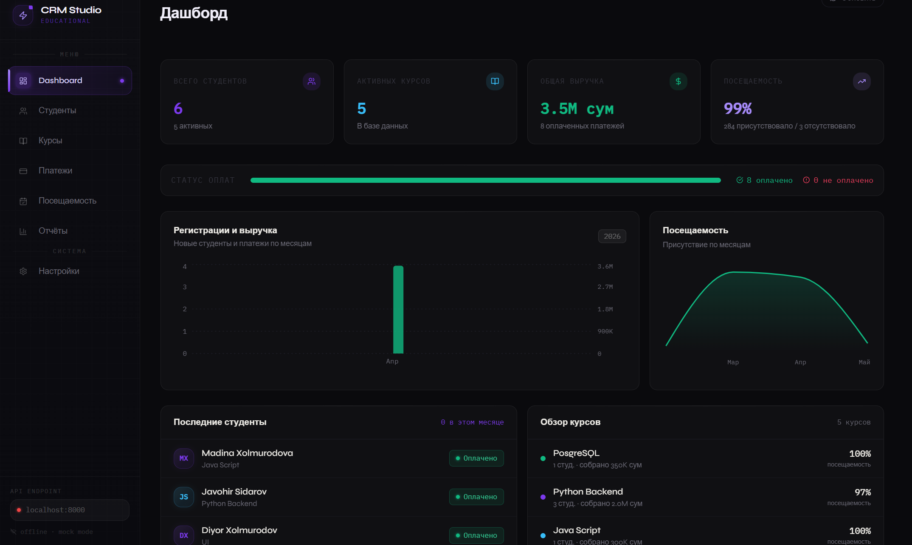
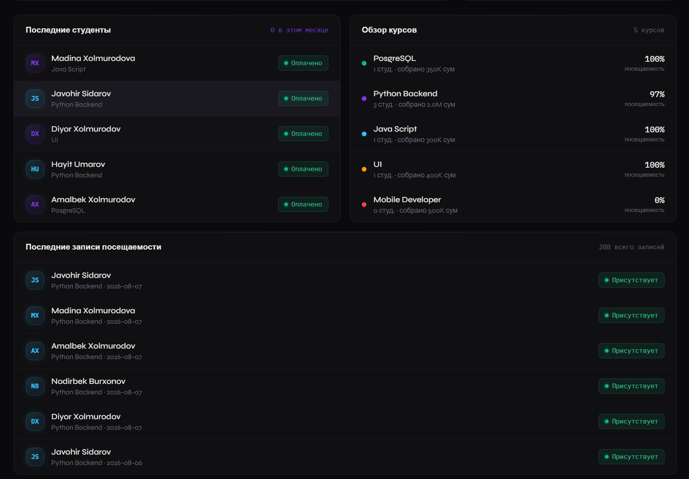
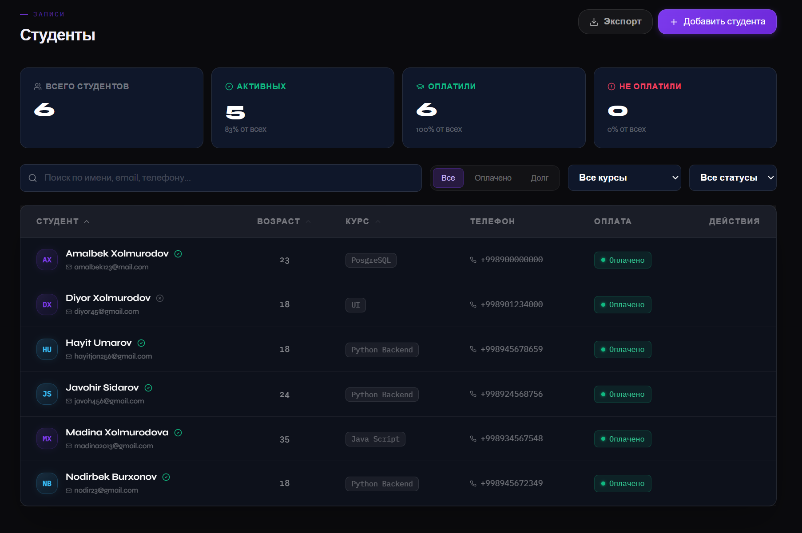
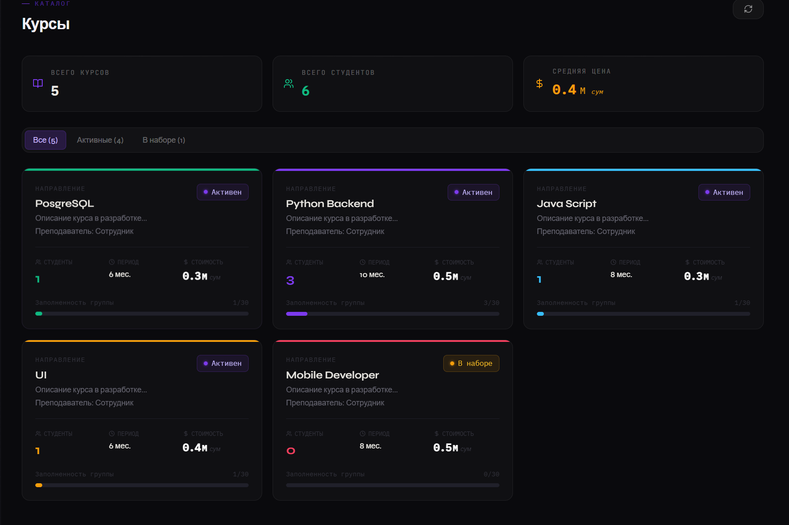
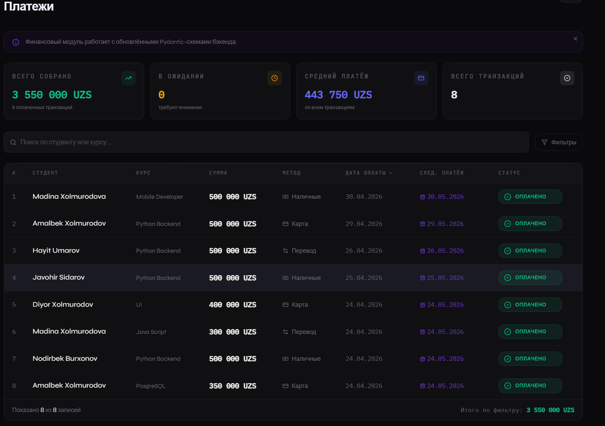
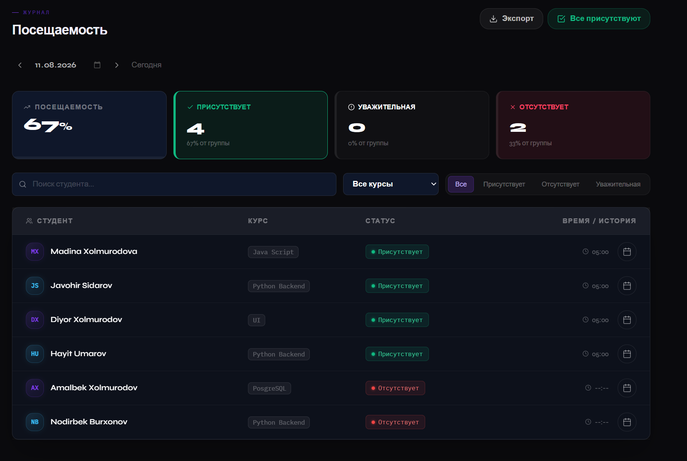
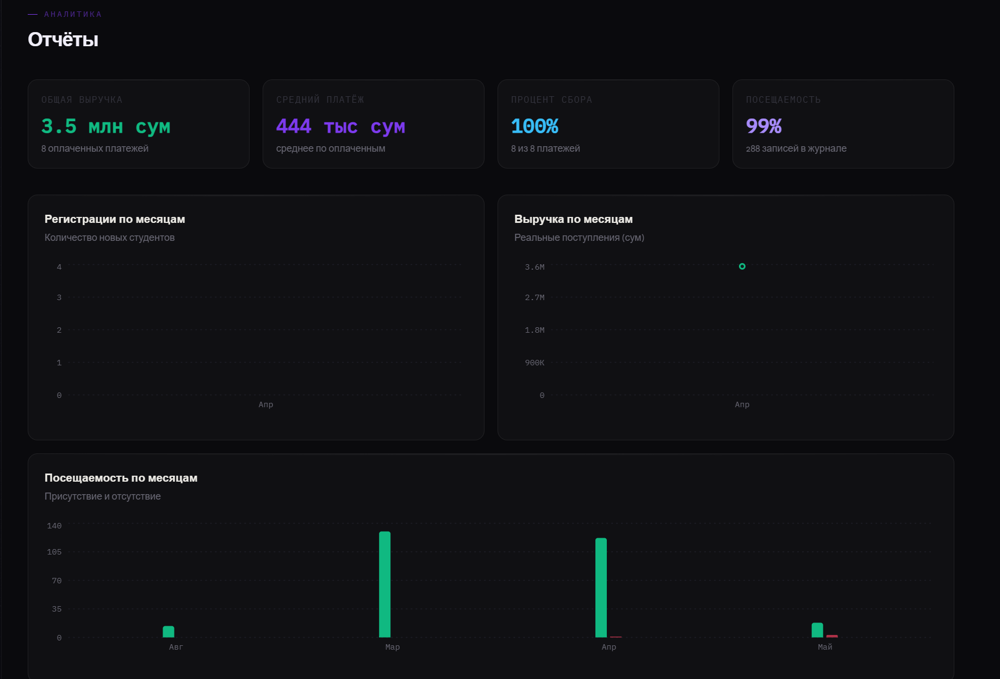
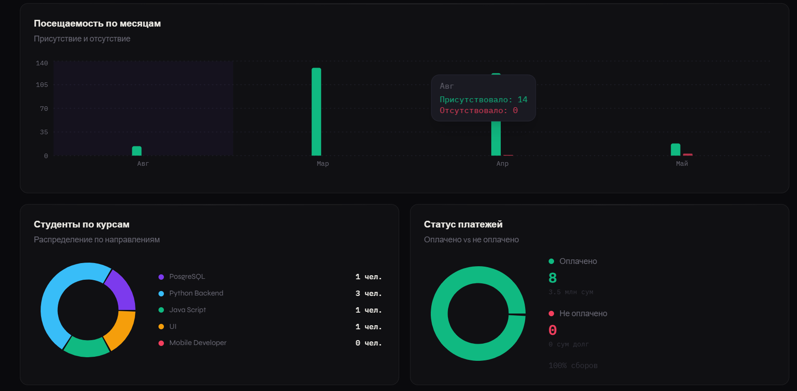
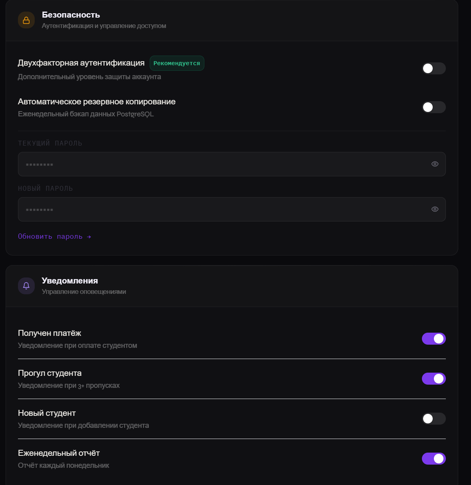

<div align="center">

# 🎓 EduCRM

  <p><b>CRM-платформа для образовательных центров: управление студентами, курсами, платежами и посещаемостью</b></p>

  <p>
    
    
    
    
    
  </p>

</div>

---

## 💡 О проекте

EduCRM — система управления образовательным центром: учёт студентов, курсов, платежей и посещаемости в единой панели с аналитикой. Backend построен на FastAPI с асинхронным доступом к PostgreSQL через SQLAlchemy, frontend — на React с Vite и Tailwind CSS.

---

## 🛠 Технологический стек

### Backend
* ⚡ **FastAPI** — асинхронный REST API
* 🧰 **SQLAlchemy 2.0** (ORM) + **Alembic** для миграций схемы БД
* 🔍 **Pydantic** — валидация данных и схемы запросов/ответов
* 💾 **PostgreSQL** — основная база данных
* 🔑 **JWT-аутентификация** и хэширование паролей (passlib)
* 🐳 Полностью контейнеризирован через **Docker Compose**

### Frontend
* ⚛️ **React** + **Vite**
* 🎨 **Tailwind CSS**

### Функциональность
* 👨‍🎓 Управление студентами (CRUD, статус активности, поиск и фильтры)
* 📚 Управление курсами
* 💳 Учёт платежей со статусами (оплачено / в ожидании / просрочено)
* 📅 Журнал посещаемости по студентам и курсам
* 📊 Дашборд с аналитикой: выручка, посещаемость, активные студенты
* 🔐 Авторизация через JWT с ролевой моделью

---
---

## 📸 Демонстрация интерфейса

> *Обзор ключевых разделов системы управления:*

### 1. Dashboard (Главная панель)
| Основной вид | Дополнительный вид |
| :---: | :---: |
|  |  |

### 2. Студенты
| Список студентов |
| :---: |
|  |

### 3. Курсы
| Управление курсами |
| :---: |
|  |

### 4. Платежи
| Финансовый учет |
| :---: |
|  |

### 5. Посещаемость
| Учет посещений |
| :---: |
|  |

### 6. Отчёты
| Аналитика 1 | Аналитика 2 |
| :---: | :---: |
|  |  |

### 7. Настройки
| Системные настройки |
| :---: |
|  |

---

## ⚙️ Быстрый запуск

### Требования
* Docker и Docker Compose

### Установка

```bash
git clone https://github.com/AmlDev887/education-crm-system.git
cd education-crm-system
```

Создай `.env` файл в корне проекта по образцу `.env.example` (переменные для БД и секретного ключа JWT).

Запусти все сервисы:

```bash
docker-compose up -d --build
```

После запуска:
* Frontend — [http://localhost:5173](http://localhost:5173)
* Backend API (Swagger) — [http://localhost:8000/docs](http://localhost:8000/docs)
* PostgreSQL — `localhost:5433`

### Применение миграций базы данных

```bash
docker exec -it crm_backend alembic upgrade head
```

---

## 📁 Структура проекта

```
EduCRM/
├── beckend_crm/
│   ├── app/
│   │   └── routers/       # Эндпоинты: students, courses, payments, attendance, auth
│   ├── alembic/            # Миграции базы данных
│   ├── models.py           # SQLAlchemy-модели
│   ├── schemas.py          # Pydantic-схемы
│   ├── database.py         # Подключение к БД
│   ├── security.py         # JWT, хэширование паролей
│   └── main.py              # Точка входа FastAPI
├── frontend_crm/
│   └── src/
│       ├── pages/           # Dashboard, Students, Courses, Payments, Attendance, Reports
│       ├── components/      # Переиспользуемые UI-компоненты
│       └── api/             # HTTP-клиент для запросов к backend
└── docker-compose.yml
```

---

## 📄 Лицензия

Проект создан в учебных целях.
